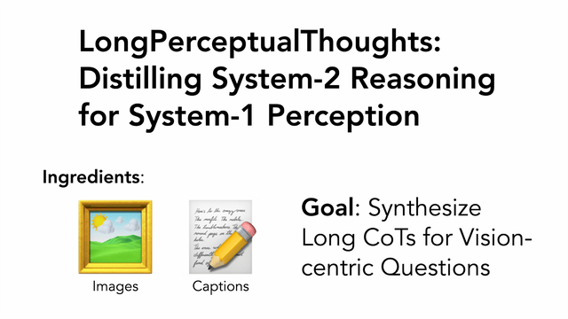

# LongPerceptualThoughts

A data engine that produces long **Chain-of-thoughts** (CoTs) data for visual reasoning. This is a joint work with Sven Elflein, Liu He, Laura Leal-Taixé, Yejin Choi, Sanja Fidler, and David Acuna.

[**paper**](https://arxiv.org/abs/2504.15362) |
[**website**](https://andrewliao11.github.io/LongPerceptualThoughts/) |
[**dataset host on Huggingface**](https://huggingface.co/datasets/andrewliao11/LongPerceptualThoughts-30k) |
[**checkpoints on Huggingface**](https://huggingface.co/collections/andrewliao11/longperceptualthoughts-6882358a8a6143fe5b4c5f44) |
[**X post**](https://x.com/andrewliao11/status/1917602672493973818)



## News
- ⭐ 2025/08/05: released checkpoints
- ⭐ 2025/05/26: updated LLaMA-Factory version for DPO training
- ⭐ 2025/05/23: released train and eval code 
- ⭐ 2025/05/09: released code for data generation
- ⭐ 2025/04/21: released paper and dataset

## 🔧 Usage


### Environment setup

Prerequisites

1. CUDA==12.4
2. torch==2.6.0
3. transformers==4.53.2
4. xformers==0.0.29.post2


Simple environment setup

```
git clone https://github.com/andrewliao11/LongPerceptualThoughts.git --recursive
cd LongPerceptualThoughts/

conda env create -f environment.yml -n LongPerceptualThoughts
# or use the script to install the environment line-by-line:
# conda create -n LongPerceptualThoughts python==3.10 -y
# conda activate LongPerceptualThoughts
# bash scripts/install_conda_env.sh
```

Note: Both LLaMA-Factory and vllm are actively developed open-source projecets and the code might break when there are version mismatches.


### Evaluate our checkpoints

The following snippet will download and prepare the benchmark data in ShareGPT format. Then download our checkpoints for evaluation.
```bash
# 1. Prepare evaluation benchmark
bash ./scripts/prepare_benchmark.sh
# 2. Run evaluation using vllm and LLaMA-factory
bash ./scripts/evaluate_lpt_checkpoints.sh
```

### Generate your own LongPerceptualThoughts

We provide a three-stage data synthesis pipeline using image-caption datasets (e.g., [google/DOCCI](https://huggingface.co/datasets/google/docci)) to generate multiple-choice questions, short CoTs and long CoTs.

```bash
export OPENAI_API_KEY=API_KEY                                     # Model used in stage 1
export QWEN2_5_VL_INSTRUCT_PATH="/PATH/TO/QWEN2.5-VL-INSTRUCT-7B" # Model used in stage 2
export R1_DISTILLED_QWEN_32_B="/PATH/TO/R1-DISTILLED-QWEN-32B"    # Model used in stage 3
bash ./scripts/generate_custom_lpt.sh
```


### Download pre-generated LongPerceptualThoughts and Post-train using LLaMA-Factory

The following snippet will first download pre-generated long CoTs from huggingface and run SFT or DPO using LLaMA-Factory.

```bash
# Download DOCCI and the pre-generated CoTs 
bash download_and_process_lpt_30k.sh
export DISABLE_VERSION_CHECK=1
export LLAMAFACTORY_DIR="LLaMA-Factory"
# The following training configs are for references. You may need to modify `model_name_or_path`, `template`, etc if needed.
llamafactory-cli train config/llama_factory_sft_train_config.yaml     # SFT training
llamafactory-cli train config/llama_factory_dpo_train_config.yaml     # DPO training
```


## 📚 Citation

If you find this repository helpful, please cite:

```bibtex
@misc{liao2025longperceptualthoughtsdistillingsystem2reasoning,
      title={LongPerceptualThoughts: Distilling System-2 Reasoning for System-1 Perception}, 
      author={Yuan-Hong Liao and Sven Elflein and Liu He and Laura Leal-Taixé and Yejin Choi and Sanja Fidler and David Acuna},
      year={2025},
      eprint={2504.15362},
      archivePrefix={arXiv},
      primaryClass={cs.CV},
      url={https://arxiv.org/abs/2504.15362}, 
}
```
