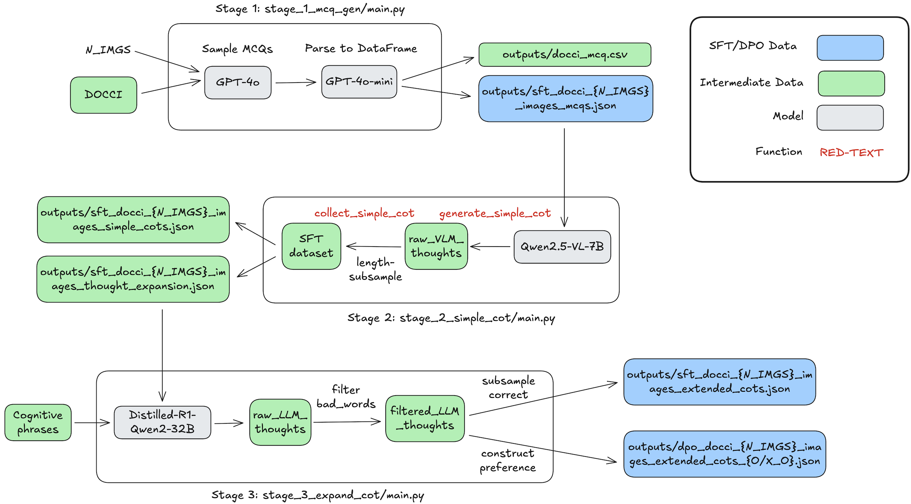

# Synthesizing LongPerceptualThoughts

Here is a pipeline to generate LongPerceptualThoughts:


In details, our data synthesis pipeline consists of three stages:

1. **Stage 1:** Generate multiple-choice questions using a large language model (LLM).
2. **Stage 2:** Generate short chain-of-thoughts using a vision-language model (VLM).
3. **Stage 3:** Expand short chain-of-thoughts into long reasoning traces using a reasoning LLM.

To run all three stages sequentially, use the provided script:

```bash
# Please prepare DOCCI captions. You can download them from https://huggingface.co/datasets/google/docci
# Here is the example structure
# caption_datasets
# └── docci
#     ├── docci_descriptions.jsonlines
#     └── images
cd caption_datasets/docci
wget https://storage.googleapis.com/docci/data/docci_descriptions.jsonlines
wget https://storage.googleapis.com/docci/data/docci_images.tar.gz
tar -xvf docci_images.tar.gz

cd ../../
bash ./run_3_stages_test.sh
```
